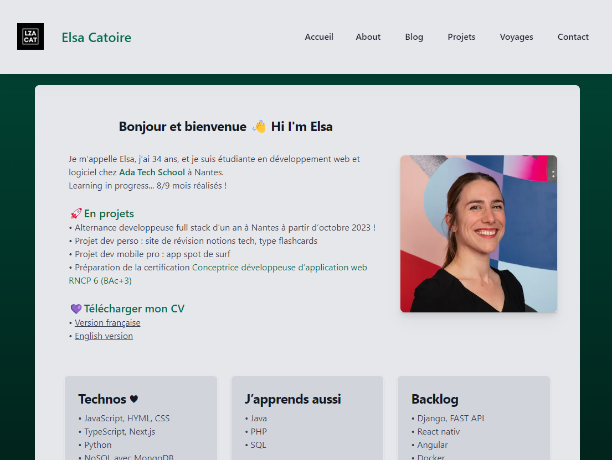
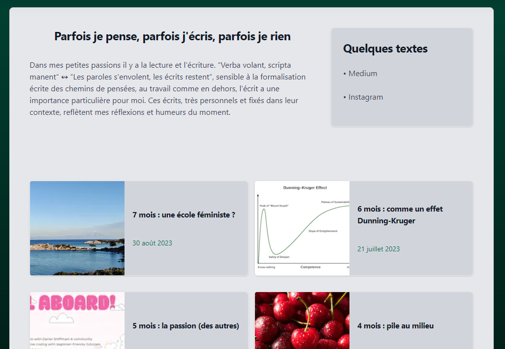
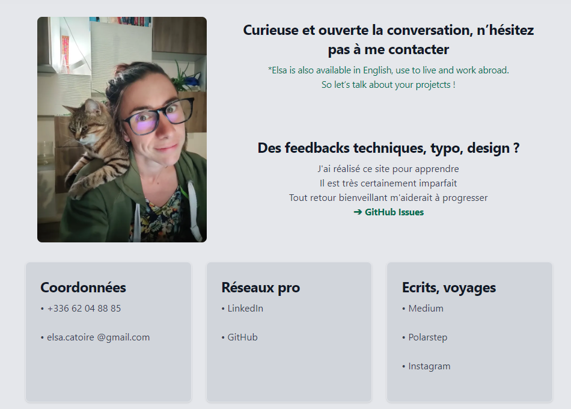

# Mon portfolio - Welcome to my portfolio !

Bienvenue sur mon portfolio en ligne ! Je suis Elsa, développeuse en apprentissage avec à coeur l'envie de développer des applications qui facilitent la vie de mes contemporains. Ce portfolio est conçu pour présenter mon travail, mes projets, mes articles de blog et mes voyages. C'est aussi un projet qui me permet d'apprendre à coder avec Next.js
- GitHub :  https://github.com/elsacatoire
- LinkedIn : https://www.linkedin.com/in/elsa-catoire-11402753/

## Technologies utilisées - Stack

- **Framework**: [Next.js](https://nextjs.org/)
- **Deployment**: [Vercel](https://vercel.com/)

## Aperçu - Preview






## Installation - Getting Started

### Récupérer le projet - Clone the project
Clonez ce dépôt sur votre machine locale.
```bash
git clone git@github.com:elsacatoire/blog-next.git
```

### Installer les dépendances - install dependencies
```bash
npm install
```

### Lancer le serveur - Run the development server:
```bash
npm run dev
# or
yarn dev
# or
pnpm dev
```

### Voir et débbug le projet - Open in browser
Ouvrir [http://localhost:3000](http://localhost:3000) dans votre naviguateur pour voir le résultat. naviguateur de développement : Chrome.

### Learn More about NextJS
To learn more about Next.js, take a look at the following resources:

- [Next.js Documentation](https://nextjs.org/docs) - learn about Next.js features and API.
- [Learn Next.js](https://nextjs.org/learn) - an interactive Next.js tutorial.

You can check out [the Next.js GitHub repository](https://github.com/vercel/next.js/) - your feedback and contributions are welcome!

Check out our [Next.js deployment documentation](https://nextjs.org/docs/deployment) for more details.
